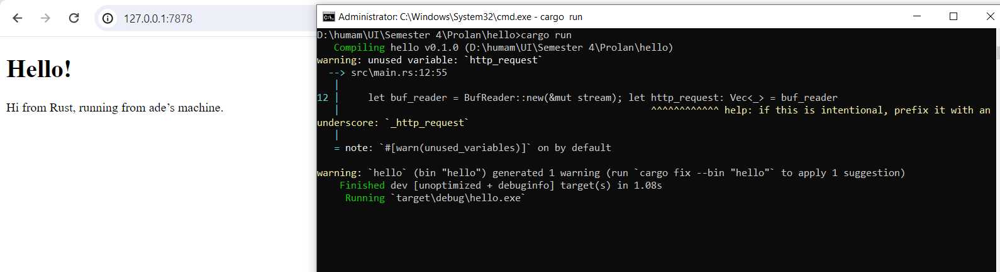
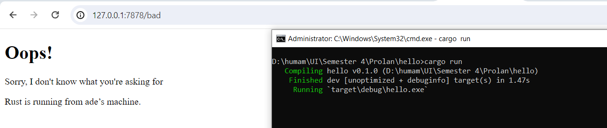

 Commit 1 Reflection notes

Di dalam handle_connection dibuat instance `BufReader` yang baru yang mengandung referensi yang bisa diubah ke `stream`. `BufReader` menambahkan buffering dengan mengelola panggilan ke metode sifat `std::io::Read` untuk kita.

Kita membuat variable bernama `http_request` untuk mengumpulkan baris permintaan yang dikirimkan browser keserver kita. Kita menunjukkan bahwa kita ingin mengumpulkan lines ini dalam vektor dengan menambahkan anotasi tipe `Vec<_>`.

`BufReader` mengimplementasikan sifat `std::io::BufRead`, yang menyediakan lines method. Lines method mengembalikan iterator `Result<String, std::io::Error>` dengan memisahkan stream data setiap kali ia melihat byte baris baru. Untuk mendapatkan setiap `String`, kita memetakan dan membuka setiap `Result`. `Result`nya mungkin error jika datanya tidak valid UTF-8 atau jika ada masalah saat membaca dari stream. Harusnya sebuah production program menghandle error dengan lebih baik, tetapi kita memilih untuk menghentikan program jika terjadi kesalahan agar lebih simple.

Browsers memberi sinyal akhir dari permintaan HTTP dengan mengirimkan dua karakter baris baru berturut-turut, jadi untuk mendapatkan satu permintaan dari stream, kita mengambil baris sampai kita mendapatkan baris yang merupakan string kosong. Setelah kita mengumpulkan garis-garisnya ke dalam vektor, kita mencetaknya menggunakan format debug yang bagus sehingga kita dapat melihat instruksi yang dikirimkan web browser ke server kita 

Commit 2 Reflection notes

Kita telah menambahkan `fs` ke pernyataan `use` untuk memasukkan modul sistem file perpustakaan standar ke dalam cakupan. Kode untuk membaca konten file ke string akan terlihat familiar

Selanjutnya, kita menggunakan `format!` untuk menambahkan konten file sebagai isi respons sukses. Untuk memastikan respons HTTP valid, kita menambahkan header Content-Length yang disetel ke ukuran isi respons kita, dalam hal ini ukuran `hello.html`.

Commit 3 Reflection notes

Kita hanya akan melihat baris pertama dari permintaan HTTP, jadi daripada membaca seluruh permintaan ke dalam vektor, kita memanggil next untuk mendapatkan item pertama dari iterator. unwrap pertama menangani Opsi dan menghentikan program jika iterator tidak memiliki item. unwrap kedua menangani `Result` dan memiliki efek yang sama dengan unwrap yang ada di peta yang ditambahkan di Listing 20-2.

Kita juga akan mengembalikan beberapa HTML agar halaman dapat dirender di browser yang menunjukkan respons kepada pengguna akhir.
Di sini, response kita memiliki baris status dengan kode status 404 dan frasa alasannya NOT FOUND. Isi responsnya adalah HTML di file 404.html. Anda harus membuat file 404.html di sebelah hello.html untuk halaman kesalahan; sekali lagi jangan ragu untuk menggunakan HTML apa pun yang Anda inginkan atau gunakan contoh HTML di Listing 20-8.
Refactoring dibutuhkan agar tidak ada kode yang duplikat atau kode yang diulang-ulang, seperti kode line yang ada setelah `status_line`.

